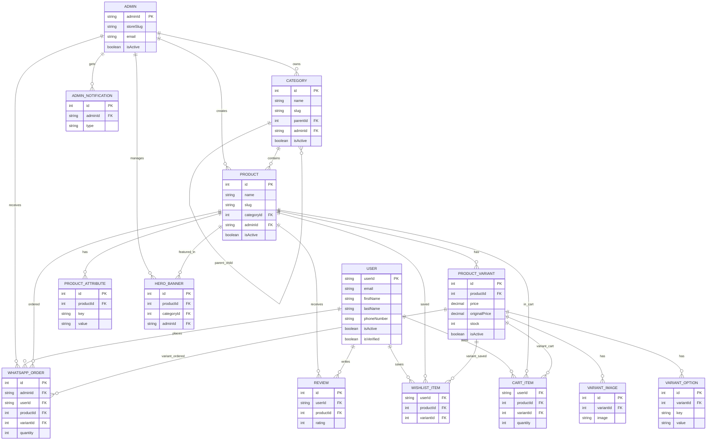

# 🚀 Commyfy — Modern E-Commerce Platform

> A scalable, full-stack e-commerce platform built with Next.js, Prisma, and modern web architecture.

---

## ⚡ Overview

Commyfy is a multi-store e-commerce system designed with performance, scalability, and modular architecture in mind.

It supports:
- Multi-store architecture (`/s/[storeSlug]`)
- Dynamic category & product system
- Infinite scrolling UI
- Admin dashboard for full control
- Server Actions + Prisma-powered backend
- Optimized Next.js App Router structure

---

## 🧠 Tech Stack

- **Frontend:** Next.js 16 (App Router)
- **Backend:** Server Actions / API Routes
- **Database:** PostgreSQL + Prisma ORM
- **Styling:** CSS Modules
- **Auth:** Personal Email Auth using redis
- **Caching:** Next.js Cache API
- **Deployment Ready:** Vercel compatible

---

## 🌌 Features

### 🛍️ Storefront
- Dynamic store pages
- Product listing with pagination
- Category-based browsing
- Infinite scroll experience

### ⚙️ Admin Panel
- Category management (nested tree structure)
- Product & variant control
- Hero banner management
- Order & review system support

### ⚡ Performance
- Cursor-based pagination
- Server-side rendering + caching
- Optimized DB queries

---




## 🧬 Architecture
```
├── app
├── lib
├── prisma
├── public
├── types
├── .gitignore
├── eslint.config.mjs
├── LICENSE
├── next.config.ts
├── package.json
├── prisma.config.ts
├── proxy.ts
├── README.md
└── tsconfig.json
```


---

## 🚀 Getting Started

```bash
git clone https://github.com/BiswajitAich/modern-store-platform
cd modern-store-platform
npm install
```

## 👨‍💻 Author

Built by Biswajit Aich [](https://www.linkedin.com/in/biswajitaich)
## ⚡ Status

🚧 Actively in development — core systems complete, optimization ongoing and some features are still incomplete.


---

If you want next upgrade, I can make it.

Just tell 👍